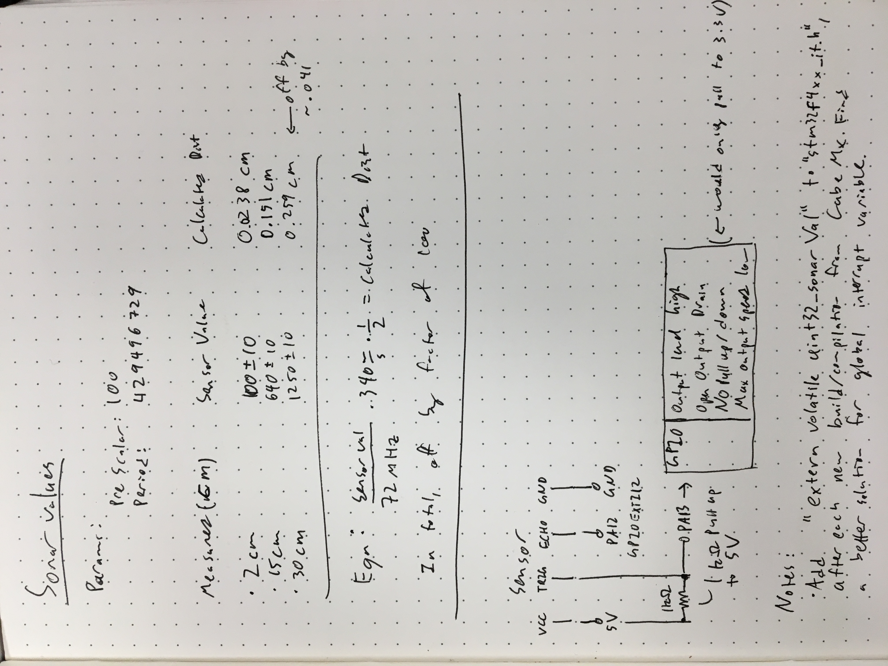

## Useful Lynx

- [STM32 Timer Functions](http://www.dmi.unict.it/~santoro/teaching/lap1/slides_pic/TimerSTM32.pdf)
- [Other Useful Information](https://en.wikipedia.org/wiki/Lynx)

# Sonar Data and Information

__If this is unreadable, let me know. I'll type it up.__

## SONAR TODO

- Refine TIM2 Prescaler value to get best values
- Figure out why distances are low by a factor of 100
- Speed it up