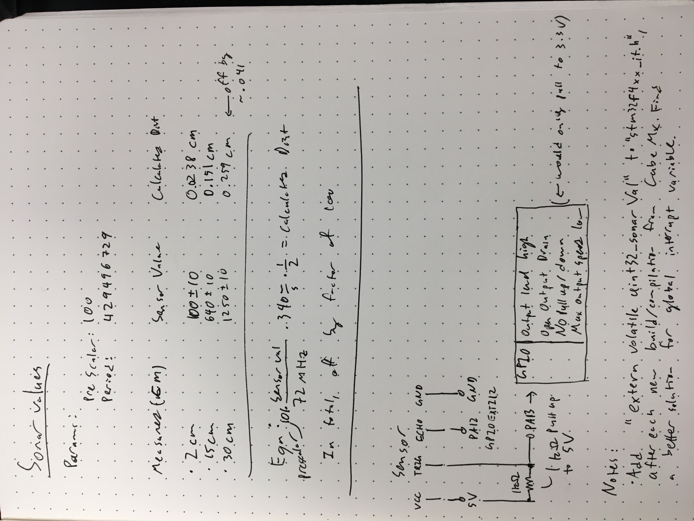

## Useful Lynx

- [STM32 Timer Functions](http://www.dmi.unict.it/~santoro/teaching/lap1/slides_pic/TimerSTM32.pdf)
- [Other Useful Information](https://en.wikipedia.org/wiki/Lynx)

# Sonar Data and Information

__If this is unreadable, let me know. I'll type it up.__

## Distance Equation

Sonar Distance = (Prescaler \* Sensor Value \* 340 m/s) / (72 MHz \* 2)
__note: I am not sure if the frequency of the timer is 72 MHz or 84 MHz - this is something to figure out__

## SONAR TODO

- Refine TIM2 Prescaler value to get best values
- Speed it up

## Sonar for Edge Detection

- Playing with it, I am not sure how it will play out as an edge detector. I think it may be too inaccurate or slow for edge detection. The benefit it gives would be if the sonar is angled at a large angle (see diagram's gamma), but the largest angle it seems to give us for (moderately) accurate angles is 35 degrees (which gives 7tan(35) = 4.9 cm from edge). However, at 35 degrees, maybe a bit less than 50% of values were erronous that would have to be filtered out). I would like to test it w/ the actual robot, but it is also late right now so I am leaving.
